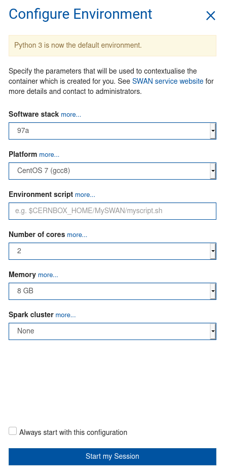
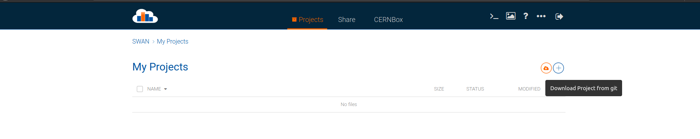
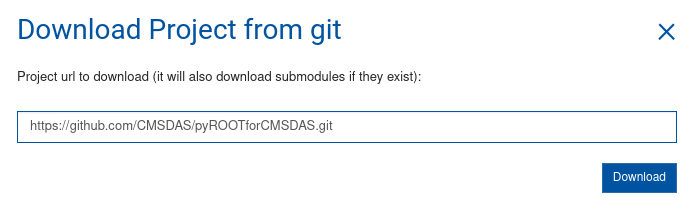

# pyROOTforCMSDAS
Files for the pyROOT exercise with CMSDAS.

## Setup

We will be using the Jupyter instance at CERN using Swan.

[https://swan.cern.ch/](https://swan.cern.ch/)

1. Select the default configuration by clicking "Start my session"

  

2. Download project from git clicking the cloud icon

  

3. Paste https://github.com/CMSDAS/pyROOTforCMSDAS.git and click download

  

5. Go to exercises.ipynb and follow the instructions